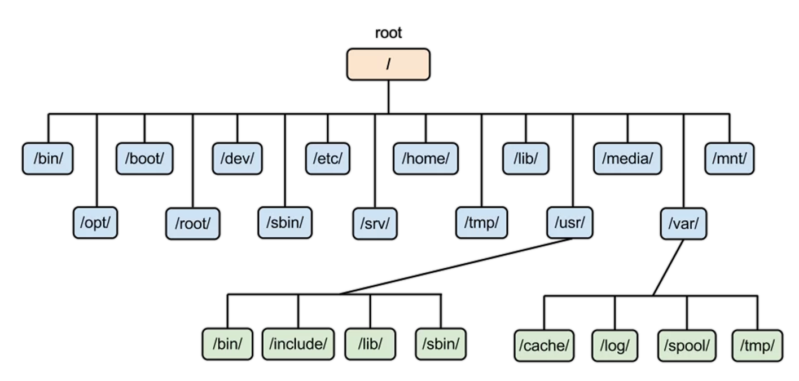
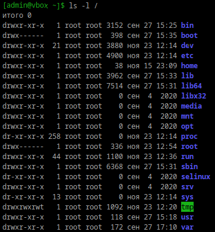

# Струтура каталогов

1) Какая структура каталогов в linux? выведите список файлов в корне системы
/ - корневая директория. Внутри неё находятся:
    /bin — программы, доступные всем пользователям.
    /sbin — программы для управления системой (обычно только для суперпользователя).
    /usr — пользовательские программы и библиотеки.
    /etc — конфигурационные файлы.
    /home — домашние директории пользователей.
    /root — домашняя директория суперпользователя.
    /var — изменяющиеся данные, такие как логи и временные файлы.
    /tmp — временные файлы.
    /dev — устройства системы (диски, порты и т. д.).

Вывод файлов в корне системы:
    ls -l /

2) Где хранятся папки пользователей в системе?
    В директории /home

3) Где домашняя папка суперпользователя?
    В директории /root

4) Где хранятся основые конфигурационные файлы в системе?
    В каталоге /etc:
    /etc/passwd — информация о пользователях.
    /etc/fstab — настройки файловых систем.
    /etc/ssh/ — конфигурация SSH.
    и др.

5) Что за папки /bin,/sbin,/usr/bin,/usr/sbin

/bin - содержит команды, которые можно использовать в однопользовательском режиме или режиме восстановления как системным администратором, так и пользователями. Он также может содержать команды, которые косвенно используются скриптами. Это общие команды: cat, chgrp, chmod, echo, kill, ls, mkdir, mount, mv, rm, rmdir, sh, su и др.

/sbin - системные исполняемые файлы. Здесь находятся программы, используемые для системного администрирования.Содержит двоичные файлы, необходимые для загрузки, восстановления системы в дополнение к двоичным файлам в /bin.

Каталог /usr содержит приложения и файлы, используемые пользователями. 
/usr/bin - содержит второстепенные приложения. 
/usr/sbin - второстепенные двоичные файлы системного администрирования.

