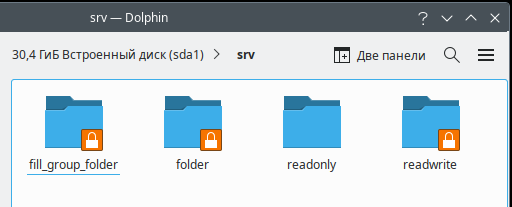
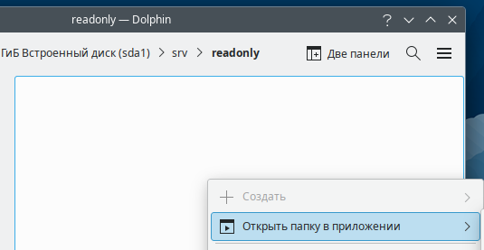
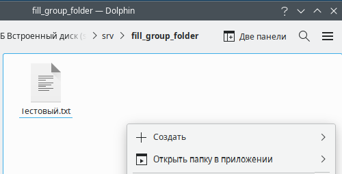
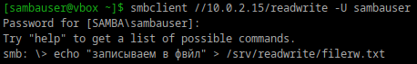

# Шарим

4 скрина

1. Установите пакет samba

    

2. Что такое общая папка, зачем оно может быть нужно?
    Общая папка — это директория, доступная для использования и редактирования другими пользователями или ус-вами в сети. 
    Используется для обмена данными в локальной сети, а также для совместной работы.

3. Создайте общую папку без пароля с правами только на чтение файлов

    

4. Создайте общую папку с паролем с правами на чтение и запись

5. Создайте общую папку с доступом для какой-то группы с полными правами

6. Создайте общую папку в которой у одной группы будет полный доступ, а у другой только доступ на чтение.
Третья группа не должна иметь к ней доступа

Итоговый файл нано с дополнительными записями:

Проверка:

1. Папки с аккаунта без прав недоступны:

2. В папке readonly не дает создавать файлы:

3. С user1, который в группе с полными правами можно зайти в папку fill_group_folder и создала там текстовый файл, записала текст:

4. Задала sambauser доступ к папке readwrite:

Зашла через sambauser в эту папку и создала файлик там:

5. Права по папкам:
